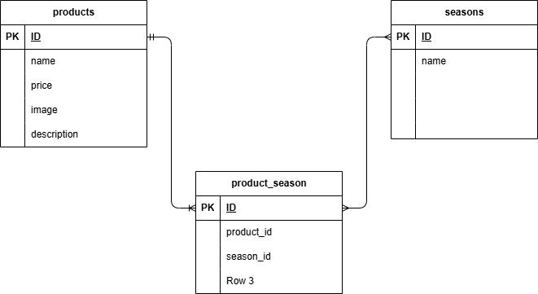

# もぎたて Freshly-picked

### 環境構築

####Docker ビルド

1. ファイルをクローン
   > git clone git@github.com:yuho-komahashi/test\_\_freshly-picked.git
1. DockerDesktop 起動
1. docker-compose up -d --build

####Laravel 環境構築

1. docker-compose exec php bash
1. composer install
1. 「.env.example」ファイルをコピーして「.env」ファイル作成、または新しく.env ファイルを作成
   > cp .env.example .env
1. 「.env」ファイルを以下に編集
   > DB_CONNECTION=mysql
   > DB_HOST=mysql
   > DB_PORT=3306
   > DB_DATABASE=laravel_db
   > DB_USERNAME=laravel_user
   > DB_PASSWORD=laravel_pass
1. アプリケーションキーの作成
   > php artisan key:generate
1. マイグレーションの実行
   > php artisan migrate
1. シーディングの実行
   > php artisan db:seed
1. シンボリックリンク作成
   > php artisan storage:link

###使用技術(実行環境)

- Laravel 8
- PHP 8.1
- Mysql 8.0.26

###ER 図

### URL

- 開発環境：http://localhost/
- phpMyAdmin：http://localhost:8080/

### 制作ページ

- 商品一覧：http://localhost/products
- 検索結果：http://localhost/products/search
- 商品詳細：http://localhost/products/{productId}
- 商品更新：http://products/{productId}/update
- 商品登録：http://localhost/products/register

#### 未実装項目

##### 商品一覧

- 並べ替え：要件内の「ポップアップ表示による並び替え機能」は表現が曖昧（セレクトボックスにしか見えませんでした）であり、要件書通りの挙動を求める場合 JavaScript での実装が必要と思われ、今回の実装範囲外のため、セレクトボックスによる UI を設置することで対応。
  なお、並べ替えは一応実装済ですが、実行ボタン未設置により挙動は未確認。
- ページネーション未実装

##### 商品詳細

- パンくずリスト未実装
- バリデーションは、一部エラー改修できていないため、「保存を変更」後商品一覧へリダイレクトせず（バリデーション未設置状態ではリダイレクト確認済）
- 削除ボタン未設置

##### 商品登録

- view ファイル作成済：未実装
- 商品削除：未実装

#### 画像保存・表示

- 画像は storage/app/public/img/ に保存されています。
- .gitignore の初期設定で storage/ 配下は Git から除外されるため、
  storage/app/public/.gitignore を修正し、画像フォルダ（img/）を除外対象から外しました。
- プロジェクト環境構築後に、シンボリックリンクを作成してください
  > php artisan storage:link
